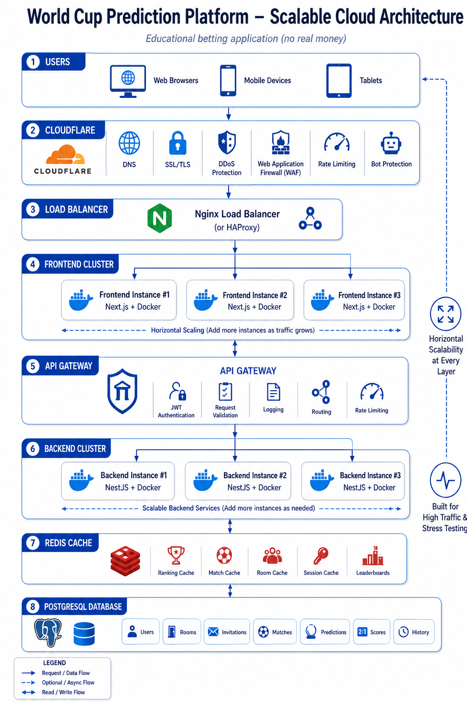

# Informe del Proyecto: Plataforma de Predicciones del Mundial

## 1. Objetivo del sistema

El proyecto consiste en disenar y desarrollar una plataforma educativa de predicciones para partidos del Mundial de futbol. Los usuarios podran registrarse, verificar su correo electronico, crear o unirse a salas, registrar predicciones antes de cada partido y acumular puntos de acuerdo con reglas de puntuacion definidas. Ademas, el sistema contara con un panel de administrador para gestionar usuarios, partidos, resultados, salas, puntajes y configuraciones generales.

La aplicacion no involucra dinero real. Su finalidad es academica y busca demostrar desarrollo de software, arquitectura escalable, contenerizacion, balanceo de carga, pruebas funcionales y pruebas de estres.

## 2. Alcance del proyecto

Se desarrollara la aplicacion completa considerando frontend, backend, persistencia de datos, cache, autenticacion con verificacion de correo, recuperacion de contrasena por codigo, panel de administrador, sistema de salas personalizables, predicciones, integracion con API externa de resultados deportivos, calculo de puntajes, ranking, podios por sala y documentacion tecnica.

El despliegue en AWS no forma parte del alcance inicial. Sin embargo, el proyecto quedara completamente preparado para desplegarse si resulta ganador, incluyendo configuraciones, variables de entorno, Dockerfiles, Docker Compose, documentacion de despliegue y estructura lista para adaptarse a la infraestructura final sin rehacer el desarrollo.

## 3. Diagrama de arquitectura

La arquitectura propuesta toma como referencia el siguiente diagrama:

Resumen de capas:

1. **Usuarios:** acceso desde navegadores web, dispositivos moviles y tablets.
2. **Cloudflare:** capa conceptual para DNS, SSL/TLS, proteccion DDoS, WAF, rate limiting y proteccion contra bots.
3. **Load Balancer:** balanceo con Nginx o HAProxy.
4. **Frontend Cluster:** multiples instancias de Next.js ejecutadas con Docker.
5. **API Gateway:** autenticacion JWT, validacion de solicitudes, logging, routing y rate limiting.
6. **Backend Cluster:** multiples instancias de NestJS ejecutadas con Docker.
7. **Integracion externa:** consumo de Football-Data.org para sincronizar partidos, estados y resultados.
8. **Redis Cache:** cache para ranking, partidos, salas, sesiones y leaderboard.
9. **PostgreSQL Database:** almacenamiento de usuarios, administradores, salas personalizables, integrantes, invitaciones, partidos, predicciones, puntajes, resultados e historial.

## 4. Modulos a desarrollar

### Frontend

El frontend se desarrollara con Next.js y Tailwind CSS. Se utilizaran capacidades de renderizado SSR y CSR segun la necesidad de cada vista: SSR para paginas que requieren carga inicial rapida o informacion publica y CSR para pantallas interactivas como predicciones, rankings, gestion de salas y panel administrativo.

El frontend tendra vistas para autenticacion, verificacion de correo, recuperacion de contrasena, listado de partidos, registro de predicciones, gestion de salas, invitaciones, ranking, podio por sala, visualizacion de puntajes acumulados y administracion del sistema.

### Backend

El backend se desarrollara con NestJS y expondra servicios para usuarios, administradores, autenticacion, verificacion de correo, recuperacion de contrasena, salas, invitaciones, partidos, predicciones, puntajes, ranking, podios por sala, historial e integracion con la API Football-Data.org. Tambien implementara la logica del sistema de puntuacion y los procesos automaticos de sincronizacion de partidos.

### Salas personalizables

Los usuarios podran crear salas o grupos de competencia. El usuario que cree una sala sera considerado propietario de la sala y podra editar sus datos principales: nombre, descripcion y color del box o tarjeta visual, permitiendo diferenciar facilmente una sala de las demas dentro de la interfaz.

Cada sala tendra su propio listado de integrantes y un podio interno con los participantes que pertenecen a ella. Este podio mostrara las mejores posiciones segun el puntaje acumulado dentro de la sala, independientemente del ranking global.

### Panel de administrador

El sistema incluira un panel de administrador con acceso y control general sobre la plataforma. Desde este panel se podran gestionar usuarios, salas, partidos, resultados, predicciones, puntajes y rankings.

El administrador tambien podra registrar o corregir manualmente resultados de partidos cuando la API externa no este disponible, presente errores de comunicacion o devuelva informacion inconsistente. Al guardar un resultado manual, el sistema recalculara los puntajes y actualizara las clasificaciones correspondientes.

### API Gateway

El API Gateway centralizara el acceso a los servicios backend. Sus responsabilidades seran validar solicitudes, autenticar mediante JWT, registrar logs, enrutar peticiones y aplicar limites de uso.

### Base de datos

PostgreSQL almacenara la informacion principal del sistema:

- Usuarios.
- Administradores y roles.
- Salas o grupos, incluyendo propietario, nombre, descripcion y color visual.
- Integrantes de cada sala.
- Invitaciones.
- Partidos.
- Predicciones.
- Resultados y puntajes.
- Podios y rankings por sala.
- Datos sincronizados desde Football-Data.org.
- Historial de participacion.

### Cache

Redis se utilizara para mejorar el rendimiento en consultas frecuentes, especialmente rankings, informacion de partidos, salas, sesiones y leaderboards.

## 5. Flujo general de usuarios

1. El usuario ingresa a la plataforma desde navegador, movil o tablet.
2. El sistema permite registrarse con correo y contrasena.
3. El usuario recibe un codigo de verificacion en su correo y debe validarlo para activar la cuenta.
4. Si olvida su contrasena, puede solicitar un codigo de recuperacion al correo registrado.
5. El usuario crea una sala o se une a una mediante invitacion.
6. Si el usuario crea una sala, puede editar el nombre, la descripcion y el color del box de la sala.
7. El usuario visualiza los partidos disponibles.
8. Antes del inicio del partido, registra su prediccion.
9. Cuando se carga el resultado real, el sistema calcula los puntos.
10. El ranking de participantes se actualiza y el podio de la sala muestra a los integrantes con mejor puntaje.

## 6. Flujo general del administrador

1. El administrador inicia sesion en el panel administrativo.
2. Visualiza usuarios, salas, partidos, predicciones, resultados y rankings.
3. Supervisa la sincronizacion automatica de partidos y resultados.
4. Registra o corrige resultados manualmente si la API externa falla o presenta inconsistencias.
5. El sistema recalcula los puntajes y actualiza los rankings globales y por sala.

## 7. Sistema de puntuacion

La plataforma implementara las reglas indicadas en el laboratorio:

- **Resultado exacto:** 5 puntos si el marcador predicho coincide exactamente con el resultado final.
- **Ganador correcto:** 3 puntos si se acierta el ganador o el empate, aunque el marcador no sea exacto.
- **Diferencia de goles correcta:** 2 puntos si se acierta el margen de victoria a favor del mismo equipo.
- **Bonus por racha:** 2 puntos extra por cada 3 partidos consecutivos acertando al menos el ganador.
- **Prediccion anticipada:** 1 punto extra si la prediccion se registra con mas de 24 horas de anticipacion.

Las predicciones realizadas de ultimo minuto, por ejemplo 10 minutos antes del partido, solo recibiran los puntos base que correspondan.

Cuando un partido cambie a estado finalizado, ya sea por sincronizacion automatica o por registro manual del administrador, el backend ejecutara el recalculo de puntajes y actualizara los rankings globales y de salas.

## 8. Integracion con API de resultados deportivos

La plataforma integrara la API externa Football-Data.org para obtener de forma automatica la informacion oficial de los partidos, incluyendo equipos participantes, fechas, horarios, estados de los encuentros y resultados finales. Esta API proporciona datos de futbol mediante servicios REST y permite consultar partidos programados, en juego y finalizados.

El sistema implementara un proceso automatico de sincronizacion ejecutado periodicamente por el backend. Dicho proceso consultara la API cada cierto intervalo de tiempo y actualizara la base de datos local con la informacion mas reciente de los partidos.

Cuando un encuentro cambie su estado a finalizado, el sistema registrara automaticamente el resultado oficial, recalculara los puntajes de los participantes segun las reglas establecidas y actualizara los rankings globales y de salas.

Como mecanismo de contingencia, el modulo de administracion permitira gestionar manualmente los resultados de los partidos. En caso de indisponibilidad de la API, errores de comunicacion o inconsistencias en los datos recibidos, un administrador podra registrar o corregir los resultados desde el panel administrativo.

Una vez guardado el resultado, el sistema ejecutara nuevamente el proceso de calculo de puntajes y actualizacion de clasificaciones. Esta estrategia hibrida garantiza la automatizacion de la plataforma, reduce la dependencia de servicios externos y asegura la continuidad operativa del sistema ante posibles fallos de integracion.

## 9. Contenerizacion con Docker

La aplicacion se preparara para ejecutarse mediante contenedores Docker:

- Contenedor para el frontend Next.js.
- Contenedor para el backend NestJS.
- Contenedor para PostgreSQL.
- Contenedor para Redis.
- Contenedor para Nginx o HAProxy como balanceador.

Se podra usar Docker Compose para levantar el entorno completo de desarrollo y pruebas en local.

## 10. Preparacion para despliegue

Aunque no se realizara el despliegue real en AWS durante esta etapa, se dejara todo listo para que el sistema pueda desplegarse rapidamente si el proyecto gana.

La preparacion incluira:

- Dockerfiles funcionales para frontend y backend.
- Docker Compose para levantar frontend, backend, PostgreSQL, Redis y balanceador.
- Variables de entorno separadas para desarrollo, pruebas y produccion.
- Configuracion preparada para dominios, certificados, API externa y credenciales.
- Documentacion con pasos de despliegue, comandos requeridos y consideraciones operativas.
- Checklist final para validar que la aplicacion esta lista antes de subirla a la nube.
- Estructura compatible con escalamiento horizontal mediante multiples instancias.

De esta manera, si el proyecto resulta ganador, el equipo solo tendra que ejecutar el proceso de despliegue sobre la infraestructura definida, sin modificar la arquitectura ni reconstruir la aplicacion desde cero.

## 11. Escalamiento horizontal y balanceo de carga

El sistema se disenara para soportar multiples instancias de frontend y backend. El balanceador distribuira las solicitudes entre las instancias disponibles, permitiendo simular escalamiento horizontal.

Este enfoque permitira demostrar que la arquitectura puede crecer agregando mas contenedores cuando aumente el trafico.

## 12. Pruebas funcionales y pruebas de estres

Se documentaran las pruebas realizadas para validar el comportamiento de la aplicacion:

- Registro e inicio de sesion.
- Verificacion de correo mediante codigo.
- Recuperacion de contrasena mediante codigo enviado al correo registrado.
- Acceso al panel de administrador.
- Gestion administrativa de usuarios, salas, partidos y resultados.
- Creacion y union a salas.
- Edicion de nombre, descripcion y color visual por el propietario de la sala.
- Registro de predicciones.
- Calculo de puntajes.
- Actualizacion de ranking global y podio por sala.
- Validacion de reglas de puntuacion.
- Sincronizacion automatica con Football-Data.org.
- Registro manual de resultados como contingencia.
- Validacion de configuracion lista para despliegue.
- Pruebas de carga sobre endpoints principales.
- Pruebas de estres para observar el comportamiento con multiples usuarios concurrentes.

## 13. Exclusiones

El despliegue real en AWS queda excluido de esta etapa. No obstante, la aplicacion quedara lista para desplegarse si el proyecto es elegido como ganador, con la configuracion y documentacion necesarias para ejecutar el despliegue posteriormente.

No se implementara dinero real, pagos, apuestas reales ni integraciones financieras.

## 14. Resultado esperado

Al finalizar el desarrollo, se contara con una plataforma funcional, contenerizada, preparada para pruebas y lista para despliegue futuro, donde los usuarios puedan crear salas personalizables, participar en salas, predecir resultados de partidos, acumular puntos, consultar rankings y visualizar podios por sala. Ademas, los administradores podran controlar la informacion principal del sistema, supervisar la sincronizacion con Football-Data.org y gestionar manualmente resultados cuando sea necesario.
